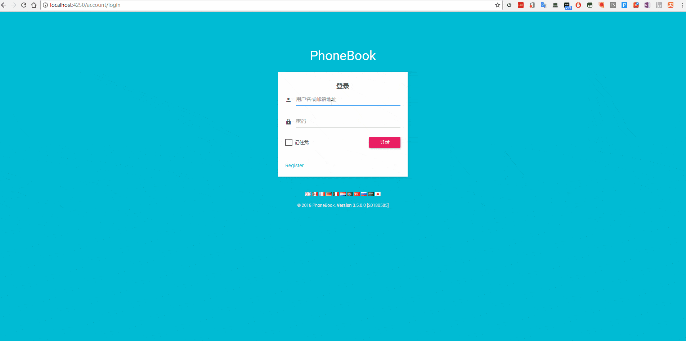
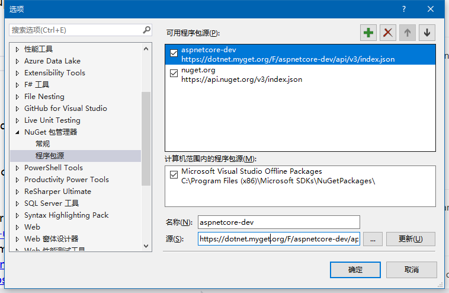
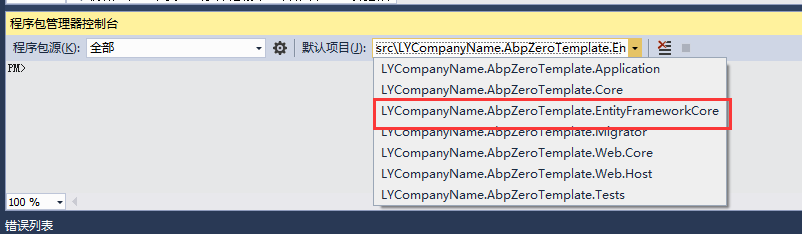

# SPA.PhoneBook
基于SPA做的电话薄项目， 前端使用的是  Angular  进行开发


## 预览效果图

拥有的功能有哪些

 




## 必备条件
#### nuget 配置
首先设置开发环境，打开nuget程序包管理器，添加一个nuget源。
```
https://dotnet.myget.org/F/aspnetcore-dev/api/v3/index.json
```
如图所示：

然后生成解决方案。

#### 数据库的生成
选择EntityFrameworkCore层，作为默认

执行
```
update-database
```

# github 令牌同步使用 sync 配置

bce44962732071871f682f83312f84528e7f31ce

Gist ID:216964ac1470977bdaf9dd33ee26b6e4


# 联系我们


**欢迎关注角落的白板报**
 


